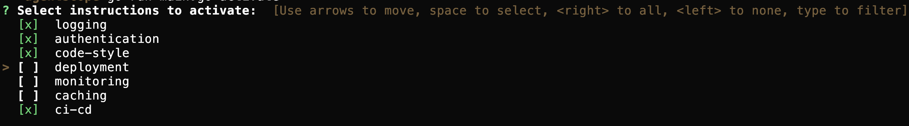

# AgentScope

A minimal context management tool for software engineers who want to maintain control over instruction files when using LLMs to work with large codebases.



## What This Does

AgentScope lets you define context for AI coding agents in markdown files and dynamically update your `CLAUDE.md` file as needed. Rather than using traditional skills, you activate only the instructions relevant to your current task.

### Why Dynamic Activation Instead of Skills?

1. Research shows that agents pay less attention to skills compared to content directly in top-level instructions.
2. Automatic activation of skills consumes significant context, reducing the effective output window. Models perform worse, especially with instruction following, well before approaching their context limit.
3. Real projects have many standards, rules, and requirements that get lost in large codebases. Including every rule in every response means the agent can't keep up.

## Installation

```bash
go install github.com/nickvanlandschoot/agentscope@latest
```

Or clone and build:

```bash
git clone https://github.com/nickvanlandschoot/agentscope
cd agentscope
go build -o agentscope
```

## Quickstart

```bash
# Initialize in your project
agentscope init

# Create instruction files
agentscope new testing-standards
agentscope new api-guidelines

# Edit the files in .agentscope/ with your content

# Activate selected instructions
agentscope activate
```

## Usage

### Commands

**`agentscope init`**
Creates a `.agentscope` directory with a `root.md` file. Add `.agentscope` to your `.gitignore` if you prefer to keep instructions local.

**`agentscope new <name>`**
Creates a new instruction file in `.agentscope/<name>.md` with default frontmatter.

**`agentscope activate`**
Opens an interactive prompt to select which instructions to activate. Selected instructions are compiled into `CLAUDE.md`.

### Editing Instruction Files

Each instruction file has frontmatter followed by markdown content:

```markdown
---
name: Display Name
position: 10
enabledByDefault: True
---

## Your Instructions Here

Write any markdown content. Use heading level 2 (##) for sections except for in root.md.
```

**Frontmatter Fields:**

- `name` - Display name shown in the activation prompt
- `position` - Sort order in the activation list (files with position 0 or no position appear last)
- `enabledByDefault` - Whether the instruction is selected by default (`True` or `False`)

**Content Guidelines:**

- Start content with heading level 2 (`##`), except for `root.md`
- Write instructions as you would in any markdown file
- When activated, all content after the frontmatter is extracted and combined into `CLAUDE.md`

## How It Works

1. Instruction files live in `.agentscope/` with YAML frontmatter
2. `agentscope activate` reads all files, sorts by position, and presents a multi-select prompt
3. Selected instructions are extracted (content after the second `---`) and combined into `CLAUDE.md`
4. Your AI assistant reads `CLAUDE.md` for context on each request

This keeps your context focused and under your control.

## License

MIT
